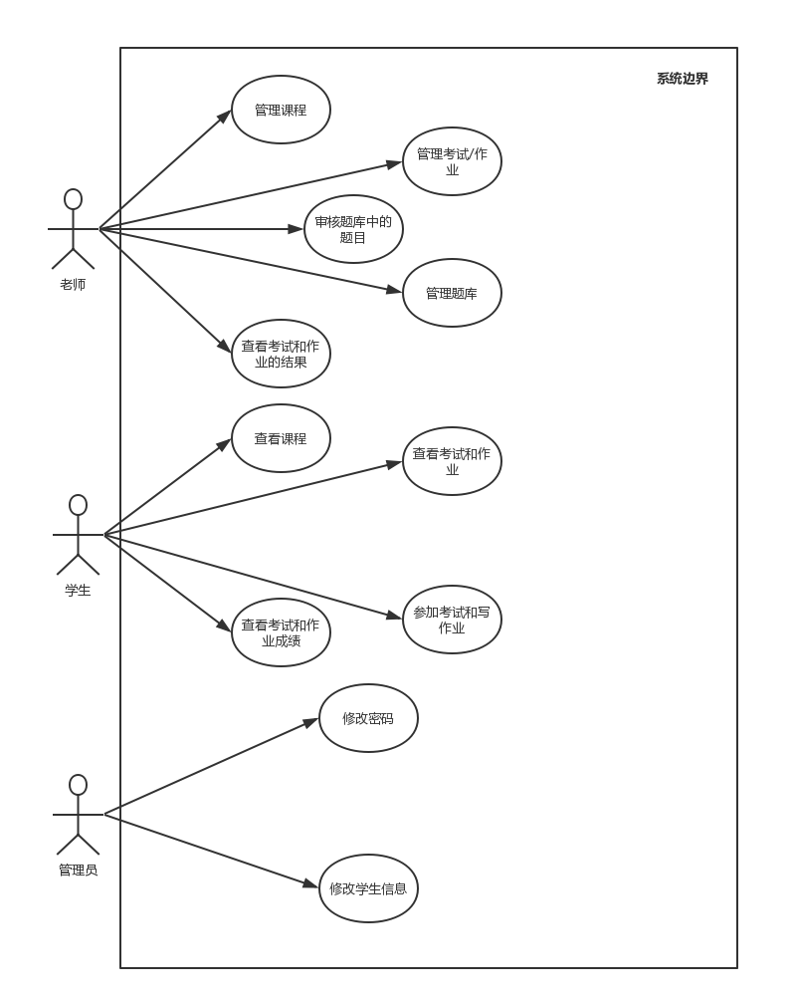

# 用例文档

[TOC]

## 用例图

##1 老师用例

### 1.1 管理课程
| Key  | Value      |
| ---- | ---------- |
| ID   | UC1        |
| 名称   | 管理课程       |
| 编辑者  | 汤大业        |
| 编辑时间 | 2016/10/21 |
| 优先级  | 高          |

#### 1.1.1 正常流程
##### 添加课程
1. 老师选择添加课程**(应用场景:老师在学期初新建课程的时候)**

2. 系统显示添加课程表单，内容包括:
   **必填项:名称**(2015级软工2,类似于原来的tss)

   **选填项:课程描述**

   **必填项:一群学生**(系统提供所有学生，老师可以通过学号或者姓名进行搜索，正常情况下，老师输入15 系统返回所有15级学生，然后老师再手动输入不是15级的学生，如果有15级的学生不参加这门课，让这个学生自己去找老师修改)，

   **选填项:一起上课的老师**(系统提供本院系所有老师，可以根据姓名搜索)

3. 老师填写表单并提交

4. 系统生成课程

##### 编辑课程
1. 老师选择编辑课程**(应用场景:可能存在一些人，他们可能是应该有这门课但是学号不对或者后来选上的，也有可能是没有这门课但是学号却又在范围内，这种个例需要找老师修改课程的学生名单;也有可能需要修改课程描述或者修改一起上课的老师的)**

2. 系统返回可以编辑的表单，内容包括:

   **课程描述**

   **学生名单**(系统提供搜索功能，可以搜索学号，如果学号在学生名单内提供删除功能，如果学号不在课程名单内提供添加功能)

   **一起上课的老师名单**

   **不可以删除**

3. 老师编辑内容

4. 系统返回编辑结果

#### 1.1.2 扩展流程

**添加课程第3步**和**编辑课程第3步**的表单填写中可能会出现填写错误情况，例如名称没填，这时候系统提示课程名还没有填写，其他的包括学生名单都保存(最好能实时提醒)

### 1.2 管理考试和作业
| Key  | Value      |
| ---- | ---------- |
| ID   | UC2        |
| 名称   | 管理考试和作业    |
| 编辑者  | 汤大业        |
| 编辑时间 | 2016/10/22 |
| 优先级  | 高          |

#### 1.2.1 正常流程

##### 添加考试

1. 老师**在某一门课中**选择添加一次考试或者一次作业(**可能在细节上会有少许不同，比如数据库中存储的时候字段值可能一个标识考试另一个标识为作业，学生在收到通知时也会区分考试和作业，但是在创建和管理时都不做区分，所以下面说的时候都不做区分，如果有需要注意的地方会粗体标出**)

2. 系统返回创建表单，内容包括:

   **必填项:名称**(软件工程第一次作业/软件工程第一次考试/软件工程一班第一次考试，因为考试在课程下面所以有些东西不用填写，当然填写了也没事)

   **选填项:描述**(简单描述下)

   **必填项:开始时间和结束时间**(精确到分钟)

   **必填项:题目**(系统提供题库里的所有题目，老师可以通过关键词搜索，也可以选择标签搜索。多选框)

   **默认项:学生**(默认设置创建课程的时候那些学生参加，老师可以添加非课程人员来参加考试，也可以让本课程的某些学生不参加这场考试)

3. 老师填写表单并提交

4. 系统生成一场考试

##### 编辑考试

1. 老师**在某一门课中**编辑一门考试或者一次作业(应用场景:有不在计划内的学生想要参加考试，有计划内的学生不参加考试，需要更改考试结束时间，需要更改作业deadline，需要增加或者减少题目)

2. 系统返回编辑表单，内容包括:

   **描述**(任何时候可以修改)

   **开始时间**(仅在开始时间还没到的时候可以修改，最早不得早过现在的时间，最迟不得迟过结束时间)

   **结束时间**(仅在结束时间还没到的时候可以修改，最早不得早过开始时间)

   **题目**(仅在开始时间还没到的时候可以修改，可以添加或者删除，不能删除所有题目)

   **学生名单**(仅在开始时间还没到的时候可以修改，系统提供搜索功能，可以搜索学号，如果学号在考试名单内提供删除功能，如果学号不在考试名单内提供添加功能)

   **删除考试**(仅在开始时间还没到的时候可以删除，再三提示)

3. 老师填写表单并提交

4. 系统返回编辑结果

#### 1.2.2 扩展流程

**添加考试第3步**和**编辑考试第3步**的表单填写中可能会出现填写错误情况，例如开始时间在现在时间之前了，或者结束时间写在开始时间之前了，这时候系统提醒时间填写有误，并且其他的保存，最好有实时提醒

### 1.3 管理题库
| Key  | Value      |
| ---- | ---------- |
| ID   | UC3        |
| 名称   | 管理题库       |
| 编辑者  | 汤大业        |
| 编辑时间 | 2016/10/22 |
| 优先级  | 中          |

#### 1.3.1 正常流程:

##### 添加题目

1. 老师请求上传题目

2. 系统返回表单，内容包括:

   **必填项:题目名称**(冒泡排序1/软件工程与计算一第一次考试第一题等等都可以，用于助记)

   **必填项:题目内容对应的压缩包**(里面放着题目的架构文件或者详细要求)

   **必填项:题目类型**(系统返回所有现有的题目的类型，老师选择，多选)

   **选填项:关联知识点**(系统返回swebok和私有知识点，老师选择，多选)

3. 老师填写表单

4. 系统把这道题加入审核题库审核队列中

##### 编辑题目

1. 老师请求更改已有的题目

2. 系统返回表单，内容包括:

   **题目名称**

   **题目内容对应的压缩包**

   **题目类型**

   **题目关联知识点**

   **暂时不可以删除**

3. 老师填写表单

4. 系统把这道题加入审核题库审核队列中

#### 1.3.2 扩展流程

**添加题目第3步**和**编辑题目第3步**的表单填写中可能会出现填写错误情况，例如题目类型没选，系统会提示题目类型没选择，最好实时提醒

### 1.4 审核题目

| Key  | Value      |
| ---- | ---------- |
| ID   | UC4        |
| 名称   | 审核题目       |
| 编辑者  | 汤大业        |
| 编辑时间 | 2016/10/22 |
| 优先级  | 低          |

#### 1.4.1 正常流程

1. 老师请求审核题目
2. 系统返回所有需要审核的题目列表
3. 老师选择某一道题
4. 系统返回这道题的题目名称和压缩包
5. 老师在确认名称和压缩包里的内容无误之后通过审核
6. 系统**调用学长的接口，把压缩包以及对应的项目名作为参数，学长的接口会把题目上传到git，并返回相应的git地址**。之后，系统把`题目的编号`，`名称`,`对应知识点`,`题目类型`和`git地址`存在本系统中。

#### 1.4.2 扩展流程

无(不考虑审核不通过的情况)

### 1.5 老师查看考试和作业的结果

| Key  | Value        |
| ---- | ------------ |
| ID   | UC5          |
| 名称   | 老师查看考试和作业的结果 |
| 创建者  | 段正谋          |
| 创建日期 | 2016-10-22   |
| 优先级  | 高            |

#### 1.5.1 正常流程

##### 查看考试和作业列表

1. 老师请求查看已经超过ddl的考试和作业列表
2. 系统返回已经超过ddl的考试和作业列表

##### 查看统计信息

1. 老师请求查看某个考试/作业的成绩统计信息
2. 系统显示所有参加考试/作业的学生的成绩的统计信息

##### 查看具体分析信息

1. 老师请求查看某个具体学生的题目具体分析信息
2. 系统返回该学生的具体分析信息

#### 1.5.2 扩展流程
1. (查看统计信息时)考试和作业的成绩统计尚未完成
   1. 系统显示成绩统计未完成 

2. (查看具体分析信息时)题目的分析未完成
   1. 系统提示题目分析未完成

## 2 学生用例

### 2.1 学生查看课程
| Key  | Value      |
| ---- | ---------- |
| ID   | UC6        |
| 名称   | 学生查看课程     |
| 创建者  | 段正谋        |
| 创建日期 | 2016-10-21 |
| 优先级  | 中          |

#### 2.1.1 正常流程

1. 学生请求查看自己的课程
2. 系统显示学生的课程列表，学生可以点击某个具体课程查看具体信息

#### 2.1.2 扩展流程
无

### 2.2 学生查看考试和作业
| Key  | Value      |
| ---- | ---------- |
| ID   | UC7        |
| 名称   | 学生查看考试和作业  |
| 创建者  | 段正谋        |
| 创建日期 | 2016-10-21 |
| 优先级  | 高          |

#### 2.2.1 正常流程

1. 学生点击课程列表的某一门课来查看该课程的考试和作业
2. 系统显示该课程的考试和作业`列表`

#### 2.2.2 扩展流程
无

### 2.3 学生参加考试和写作业

> 这个不是你们系统的用例。是王琨学长的用例
> 你们的用例应该是，在学生看到考试列表后，可以点击按钮进入考试。
> 如果想保留王琨学长的用例，和王琨学长确认相应细节。

| Key  | Value      |
| ---- | ---------- |
| ID   | UC8        |
| 名称   | 学生参加考试和写作业 |
| 创建者  | 段正谋        |
| 创建日期 | 2016-10-21 |
| 优先级  | 高          |

#### 2.3.1 正常流程

1. 考试/作业开始时间已到，学生打开CHE
2. 系统在本地搜索`用户名`,`密码`和`配置`，并以此加载CHE环境
3. 学生在CHE中考试或写作业
6. ddl已到，学生查看题目分析结果
7. 系统返回题目的分析结果，分析结果包含`各个题目的分数`,`总得分`
8. 学生请求查看某个题的具体分析
9. 系统返回该道题的具体分析（页面由分析系统提供）

#### 2.3.2 扩展流程
1. (1)考试时间未到，学生打开CHE

2. (8)学生请求查看时系统分析未完成,
   1. 系统显示正在分析

### 2.4 学生查看考试和作业成绩
| Key  | Value       |
| ---- | ----------- |
| ID   | UC9         |
| 名称   | 学生查看考试和作业成绩 |
| 创建者  | 段正谋         |
| 创建日期 | 2016-10-22  |
| 优先级  | 高           |

#### 2.4.1 正常流程

1. 学生请求查看已完成的考试或作业的成绩
2. 系统显示相应考试或作业的成绩

#### 2.4.2 扩展流程
1. 学生请求查看成绩的时候成绩还未分析出
   1. 系统显示成绩分析中

## 3 管理员用例

### 3.1 修改密码 
| Key  | Value      |
| ---- | ---------- |
| ID   | UC10       |
| 名称   | 修改密码       |
| 创建者  | 汤大业        |
| 创建日期 | 2016-10-22 |
| 优先级  | 低          |

#### 3.1.1 正常流程

1. 管理员请求修改某个用户的密码(**应用场景:用户忘记密码了**)
2. 系统返回安全措施(**验证码，验证问题**)
3. 管理员填写安全码
4. 系统确认无误的情况下，把用户的密码变成默认(和用户名相同)

#### 3.1.2 扩展流程

**第3步**中验证码输入错误

系统更换验证码请求再次输入

### 3.2 管理员修改学生信息
| Key  | Value      |
| ---- | ---------- |
| ID   | UC11       |
| 名称   | 管理员修改学生信息  |
| 创建者  | 段正谋        |
| 创建日期 | 2016-10-22 |
| 优先级  | 低          |
#### 3.2.1 正常流程

1. 管理员请求修改某个学生的信息
2. 系统显示该学生的信息并将允许编辑的项设置为可编辑状态
3. 管理员更改信息并保存
4. 系统提示保存成功

#### 3.2.2 扩展流程
1. (3)管理员将不能为空的项错误地置为空后提交保存
   1. 系统提示有不能为空的项未填写
   2. 管理员补填相关项，并提交
   3. 系统提示修改成功

